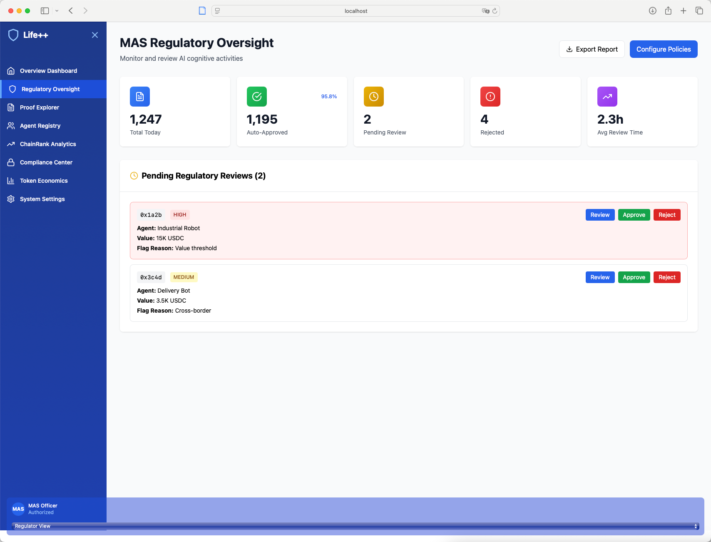
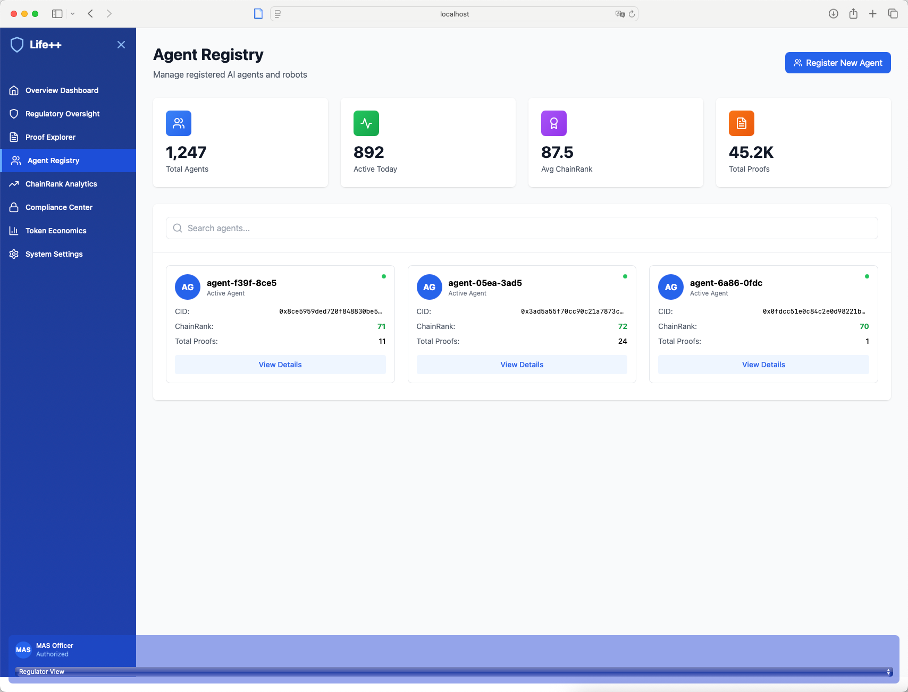
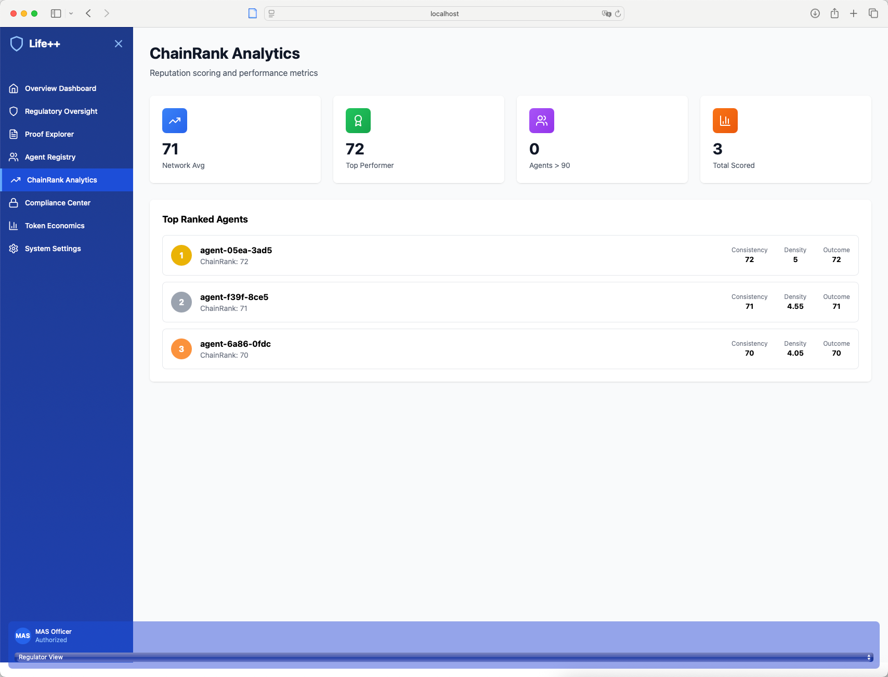
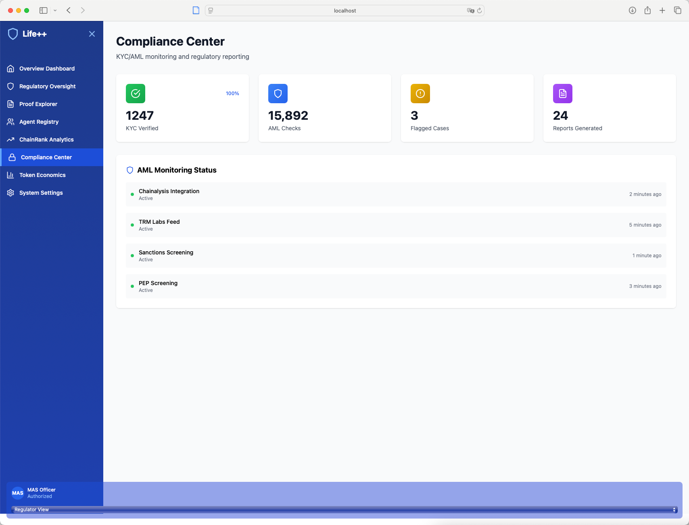
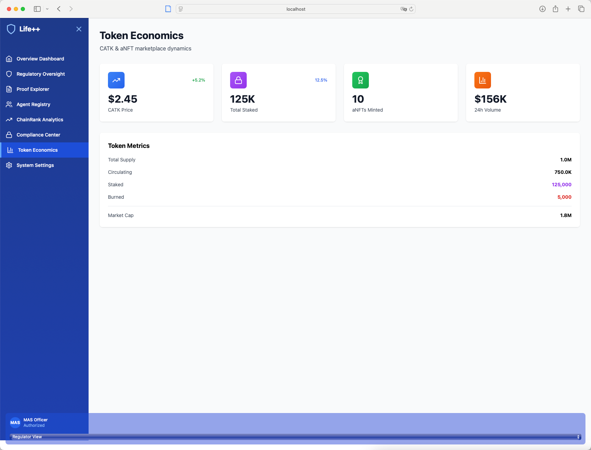
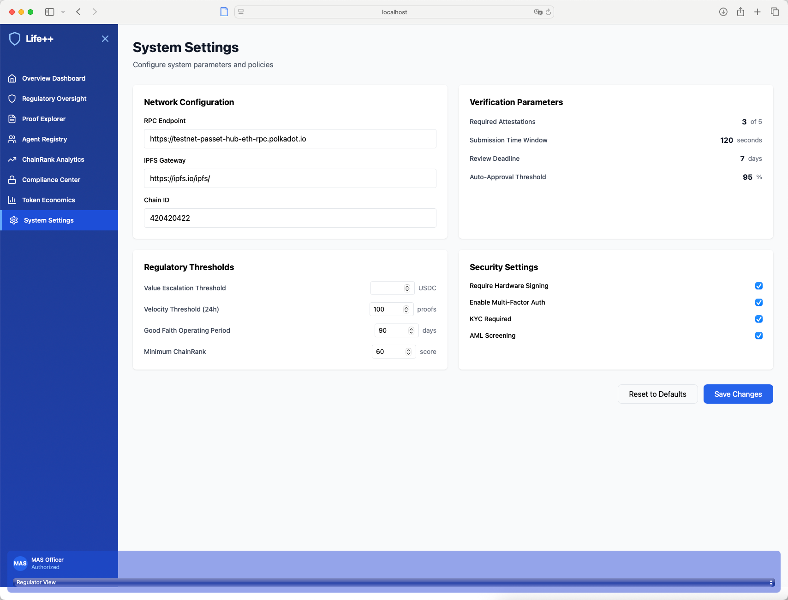

# Life++ PoC - 基于 Polkadot REVM 的认知证明系统

[`English`](./README.en.md) | [`中文`](./README.md)

## 🎯 项目概述

Life++ PoC 是一个基于 Polkadot REVM 的**认知证明系统**，为 AI 代理、机器人和数字孪生提供可验证的认知过程证明。项目实现了完整的端到端解决方案，从智能合约到用户界面。

## 🖼️ 页面展示

按照左侧菜单顺序，前端提供了完整的业务功能页面，便于评委/用户快速上手体验：

- **Overview Dashboard（总览仪表盘）**: 展示当日证明量、活跃代理、在线验证者、平均验证时长；包含 24h 提交量柱状图、系统健康（区块链/IPFS/验证网络/API 服务）与最近活动、Top Agents 排行。
  
  
- **Regulatory Oversight（监管审查）**: 汇总今日统计（自动通过/待审/拒绝等），罗列“待审查证明”卡片，支持一键 Review/Approve/Reject 的监管动作，适配合规工作流。
  
  
- **Proof Explorer（证明浏览器）**: 支持按关键字搜索与状态筛选，表格展示 Proof ID、Agent、Status、Value、Validators、Time，提供“View Details” 查看链上/存证详情。
  
  
- **Agent Registry（代理注册）**: 展示代理总量、当日活跃、平均 ChainRank、总证明数；卡片化列出 Agent 的 CID、ChainRank、Proofs，并可查看详情。
  
  
- **ChainRank Analytics（声誉分析）**: 展示网络平均、Top Performer、达标统计、总计入数量；列表展示 Top Ranked Agents 及 Consistency/Density/Outcome 等指标。
  
  
- **Compliance Center（合规中心）**: 展示 KYC/AML 指标与监控状态（如 Chainalysis、TRM、制裁名单、PEP 等）的运行情况与更新时间，服务健康一目了然。
  
  
- **Token Economics（代币经济）**: 展示 CATK 价格、总质押、aNFT 铸造量、24h 成交量，并以表格汇总代币核心指标（供应、流通、质押、销毁、市值等）。
  
  
- **System Settings（系统设置）**: 可配置网络（RPC、IPFS、ChainId）、验证参数（所需见证数、窗口、截止、自动通过阈值）、监管阈值与安全设置；支持“恢复默认/保存”。
  
  

> 以上所有页面已在前端实现并可直接访问，示意图见上方截图。

> 数据来源说明（真实/模拟）：
>
> - Overview Dashboard：
>   - 真实：Top Performing Agents（从链上经 Indexer 拉取）
>   - 模拟：四个概览卡片与 24h 柱状图、Recent Activity、System Health 指标（用于展示完整 UI 效果）
> - Regulatory Oversight：主要为模拟数据（演示监管流程与操作按钮）
> - Proof Explorer：真实链上数据（支持搜索与状态筛选，详情弹窗真实接口）
> - Agent Registry：真实链上数据（代理卡片与统计）
> - ChainRank Analytics：统计面板与排行榜为模拟汇总（用于演示指标与排序）
> - Compliance Center：监控状态为模拟数据（演示集成位点与健康展示）
> - Token Economics：代币与交易指标为模拟数据（演示经济看板）
> - System Settings：前端配置表单（演示交互，不作为持久化配置来源）

## 🏗️ 项目架构

```
+================================================================+
|                    Life++ PoC 系统架构                          |
+================================================================+
|                                                                |
|  [机器人/数字孪生层]                                              |
|  +------------------+      +------------------+                |
|  |   Robot SDK      | ---> |  AHIN Indexer     |               |
|  |   (TypeScript)   |      |  (Express.js)    |                |
|  +------------------+      +------------------+                |
|                                |                               |
|                                v                               |
|  [IPFS 存储层]                                                  |
|  +------------------+ +------------------+ +------------------+|
|  |   证据包存储      | |   元数据存储      | |   推理过程存储      ||
|  +------------------+ +------------------+ +------------------+|
|                                |                               |
|                                v                               |
|  [区块链层 - PassetHub 测试网]                                   |
|  +------------------+ +------------------+ +------------------+|
|  |  PoC Registry    | |   PoC Ledger     | |   CATK Token     ||
|  |   代理注册        | |   证明验证        | |   代币激励         ||
|  +------------------+ +------------------+ +------------------+|
|  +------------------+ +------------------+                     |
|  |  Action Proof    | |  Legal Wrapper   |                     |
|  |      NFT         | |    合规管理       |                     |
|  |   行动证书        | |                  |                     |
|  +------------------+ +------------------+                     |
|                                |                               |
|                                v                               |
|  [验证层]                                                       |
|  +------------------+ +------------------+ +------------------+|
|  | Validator Daemon | |    CAT 算法      | |  多验证器网络       ||
|  |                  | |   4阶段验证       | |   共识机制         ||
|  +------------------+ +------------------+ +------------------+|
|                                                                |
+================================================================+
```

## 🎯 项目核心功能

### 1) 核心智能合约
- **PoC Registry**: 代理注册和身份管理
- **PoC Ledger**: 认知证明提交和验证
- **CATK Token**: ERC-20 代币，用于质押和激励
- **Action Proof NFT**: ERC-721 证书，代表已验证的认知行动
- **Legal Wrapper**: 合规性和司法管辖区管理

### 2) 链下服务架构
- **AHIN Indexer**: 证据打包、IPFS 上传、区块链交互
- **Validator Daemon**: 运行 CAT 算法进行证明验证
- **Robot SDK**: TypeScript/Python SDK，提供标准化 API
- **IPFS 存储**: 去中心化证据包存储

### 3) 技术特性
- **REVM 兼容**: 基于 Polkadot REVM，支持以太坊工具链
- **跨链支持**: 利用 Polkadot 生态的跨链能力
- **可扩展性**: 模块化设计，支持多种验证算法
- **安全性**: 多重验证机制，确保认知证明的真实性
- **去中心化验证**: 支持多验证者共识机制（生产环境需3个验证者，测试环境可动态调整）

### 4) 应用场景
- **AI 代理验证**: 为 AI 系统提供可验证的认知过程证明
- **机器人认证**: 确保机器人行为的真实性和可追溯性
- **数字孪生**: 为数字孪生系统提供认知状态验证
- **跨链集成**: 利用 Polkadot 生态实现跨链认知证明

## 🔄 业务工作流程

### 完整认知证明流程

```
++===============================================================+
|                      认知证明业务流程                             |
++===============================================================+
|                                                                |
|  [1] 代理注册阶段                                                |
|  +------------------+      +------------------+                |
|  |  机器人/代理      | ---> |  PoC Registry     |                |
|  |  提交注册信息      |      |  存储代理 CID      |               |
|  +------------------+      +------------------+                |
|                                                                |
|  [2] 认知过程执行                                                |
|  +------------------+      +------------------+                |
|  |  接收任务输入      | ---> |  执行认知推理       |               |
|  |  (传感器数据)      |      |  (AI 决策过程)     |               |
|  +------------------+      +------------------+                |
|                                                                |
|  [3] 证据打包阶段                                                |
|  +------------------+      +------------------+                |
|  |  AHIN Indexer    | ---> |  IPFS 存储         |               |
|  |  打包证据数据      |      |  生成证据 CID       |              |
|  +------------------+      +------------------+                |
|                                                                |
|  [4] 区块链提交阶段                                              |
|  +------------------+      +------------------+               |
|  |  PoC Ledger      | ---> |  生成证明 ID       |               |
|  |  提交证明哈希      |      |  记录时间戳         |              |
|  +------------------+      +------------------+               |
|                                                               |
|  [5] 验证阶段                                                  |
|  +------------------+      +------------------+               |
|  | Validator Daemon | ---> |  CAT 算法验证       |              |
|  | 运行验证算法       |      |  四阶段验证流程      |              |
|  +------------------+      +------------------+               |
|                                                               |
|  [6] 结果生成阶段                                               |
|  +------------------+      +------------------+               |
|  |  Action NFT      | ---> |  CATK 代币         |              |
|  |  生成行动证书      |      |  奖励分配           |              |
|  +------------------+      +------------------+                |
|                                                                |
++===============================================================+
```

### 详细业务流程说明

#### 1️⃣ **代理注册阶段**
- **输入**: 机器人/代理的基本信息、元数据哈希
- **处理**: 通过 `PoCRegistry.registerAgent()` 注册代理
- **输出**: 代理 CID（内容标识符）存储在区块链上
- **数据生成**: 
  - 代理地址 → CID 映射
  - 注册时间戳
  - 质押金额记录

#### 2️⃣ **认知过程执行**
- **输入**: 传感器数据、任务指令、环境信息
- **处理**: 机器人执行认知推理，生成决策过程
- **输出**: 结构化的认知过程数据
- **数据生成**:
  - 输入数据包
  - 推理步骤序列
  - 输出结果
  - 元数据（模型版本、置信度等）

#### 3️⃣ **证据打包阶段**
- **输入**: 完整的认知过程数据
- **处理**: AHIN Indexer 将数据打包成结构化证据
- **输出**: IPFS 上的证据包
- **数据生成**:
  - 证据包 CID
  - Merkle 树根哈希
  - 加密签名
  - 时间戳和版本信息

#### 4️⃣ **区块链提交阶段**
- **输入**: 证据包 CID 和元数据
- **处理**: 通过 `PoCLedger.submitProof()` 提交证明
- **输出**: 区块链上的证明记录
- **数据生成**:
  - 证明 ID（唯一标识符）
  - 证据哈希
  - 提交时间戳
  - 交易哈希

#### 5️⃣ **验证阶段**
- **输入**: 提交的证明数据
- **处理**: Validator Daemon 运行 CAT 算法
- **输出**: 验证结果和评分
- **数据生成**:
  - 语法检查结果
  - 因果一致性评分
  - 意图匹配度
  - 对抗鲁棒性测试结果
- **共识机制**:
  - 生产环境：需要3个独立验证者达成共识（防止单点作恶）
  - 测试环境：验证阈值可动态调整为1（便于评委快速测试）
  - 合约提供 `setRequiredAttestations()` 函数实现灵活的治理机制

#### 6️⃣ **结果生成阶段**
- **输入**: 验证通过的证明
- **处理**: 生成 NFT 证书和分配奖励
- **输出**: 可验证的认知行动证书
- **数据生成**:
  - Action Proof NFT（ERC-721）
  - CATK 代币奖励
  - 链排名更新
  - 合规记录

### 业务价值体现

#### 🎯 **对机器人/代理的价值**
- **可验证性**: 每个认知决策都有区块链证明
- **可信度**: 通过多验证器网络确保真实性
- **激励**: 通过 CATK 代币获得经济激励
- **声誉**: 建立基于验证的声誉系统

#### 🏢 **对企业的价值**
- **审计合规**: 满足监管要求的可审计记录
- **质量控制**: 确保 AI 系统的决策质量
- **风险控制**: 通过验证机制降低 AI 风险
- **品牌信任**: 建立基于技术的信任机制

#### 🌐 **对生态的价值**
- **标准化**: 建立认知证明的行业标准
- **互操作性**: 跨平台、跨链的证明互认
- **创新激励**: 鼓励更好的认知算法发展
- **数据价值**: 创造可验证的认知数据资产

## 🚀 快速开始

### 环境要求
- Node.js 18+
- npm 或 yarn
- Git

### 1. 克隆项目
```bash
git clone https://github.com/OneBlockPlus/polkadot-hackathon-2025.git
cd polkadot-hackathon-2025/1942-life++-poc
```

### 2. 安装依赖
```bash
npm install
```

### 3. 环境配置

#### 3.1 复制环境配置文件
```bash
# 复制环境配置文件（包含所有必要配置，但不包含私钥）
cp .env.passetHub .env
```

#### 3.2 配置钱包私钥
**重要**: 评委需要配置自己的测试钱包：

```bash
# 编辑环境文件
nano .env
# 或者使用其他编辑器：vim .env, code .env, notepad .env 等
# macOS/Linux: nano, vim, code
# Windows: notepad, code

# 在.env文件中找到以下行并替换为你的测试钱包私钥：
PRIVATE_KEY=0x你的测试钱包私钥
```

**配置说明**：
- ✅ **PRIVATE_KEY**: 评委需要配置自己的测试钱包私钥
- ✅ **DEPLOYER_PRIVATE_KEY**: 已预配置，无需修改（用于自动转账CATK）
- ✅ **地址自动推导**: 钱包地址会自动从私钥推导，无需手动配置
- ✅ **所需代币**: 评委钱包只需要测试网ETH（用于Gas费），CATK会自动转账

**安全提醒**：
- ⚠️ **请使用测试钱包**，不要使用主钱包或有真实资产的钱包
- ⚠️ **DEPLOYER_PRIVATE_KEY** 是Hardhat默认测试私钥（公开可用，仅用于测试网）
- ⚠️ 测试完成后可以删除测试钱包
- ✅ 测试网ETH可以通过水龙头免费获取


### 3.3 合约部署（可选）

> **📝 说明**: 合约已在 PassetHub 测试网部署完成，无需重新部署。若执行部署脚本，不影响业务运行，当前暂不提供部署脚本。

### 4. 测试环境启动（一步完成）

```bash
# 一键启动测试环境（包含：环境检查、网络验证、钱包验证、功能测试、服务启动）
npm run start:test
```

**前提条件**：确保已完成第3步的环境配置

**启动流程包含**：
- ✅ **环境配置检查** - 私钥格式、网络连接、钱包余额
- ✅ **智能合约功能测试** - CATK、Registry、Ledger、NFT、Legal Wrapper
- ✅ **服务层功能测试** - Validator Daemon、AHIN Indexer
- ✅ **API 接口测试** - 健康检查、认知事件提交
- ✅ **端到端流程测试** - 合约部署、网络连接、钱包状态
- ✅ **测试数据记录** - 测试前后数据对比
- ✅ **服务真实启动** - AHIN Indexer + Validator Daemon（保持运行）

**启动完成后**：
- 🌐 **AHIN Indexer**: http://localhost:3000 (认知事件索引服务，**真实运行中**)
- 🔧 **Validator Daemon**: 后台运行 (证明验证服务，**真实运行中**)
- 📊 **查看测试结果**: `npm run show:deployment-data`
- 🧪 **测试覆盖**: 智能合约 + 服务层 + API + 端到端流程
- ⚠️ **重要**: 服务启动后会持续运行，按 `Ctrl+C` 可停止所有服务

### 5. 前端服务启动

前端提供了完整的Web界面，用于查看和管理认知证明数据。

#### 5.1 服务启动

```bash
# 进入前端目录
cd frontend

# 安装依赖（首次运行需要）
npm install

# 启动开发服务器
npm run dev
```

**启动完成后**：
- 📱 **前端界面**: http://localhost:5173 (Vite默认端口，如果被占用会自动切换)
- 🌐 **访问地址**: 打开浏览器访问显示的地址（通常是 http://localhost:5173 或 http://localhost:5174）

**功能模块**：
- 📊 **Overview Dashboard** - 系统概览和统计
- 🔍 **Proof Explorer** - 查看和管理所有证明（支持详情查看和时间排序）
- 👥 **Agent Registry** - 查看和管理AI代理（显示真实数据）
- 📈 **ChainRank Analytics** - 代理排名和性能分析
- 🛡️ **Regulatory Oversight** - 监管审查和审批
- ✅ **Compliance Center** - 合规检查和监控
- 💰 **Token Economics** - 代币和NFT经济数据
- 🤖 **Robot Control** - AI机器人控制面板
- ⚙️ **System Settings** - 系统配置和管理

**数据说明**：
- ✅ **真实数据**: 证明列表、代理列表、Recent Activity均从链上查询真实数据
- ✅ **混合方案**: Dashboard统计使用混合数据（真实+模拟），确保界面完整显示
- ✅ **数据标识**: 所有数据都标记了来源（`isReal: true` 或 `dataSource: 'real'/'mock'`）

## 📋 已部署合约地址

**PassetHub 测试网部署地址**:
- **PoC Registry**: `0x...` (代理注册合约)
- **PoC Ledger**: `0x...` (证明验证合约)
- **CATK Token**: `0x...` (代币合约)
- **Action Proof NFT**: `0x...` (NFT 合约)
- **Legal Wrapper**: `0x...` (合规合约)

## 🧪 测试验证

**完整功能测试包含**：
- ✅ **环境配置验证** - 私钥格式、网络连接、钱包余额
- ✅ **智能合约功能测试** - CATK、Registry、Ledger、NFT、Legal Wrapper
- ✅ **自动CATK转账** - 部署者钱包自动转账CATK给评委
- ✅ **自动证明验证** - 部署者钱包自动验证认知证明
- ✅ **自动NFT发放** - 验证通过后自动铸造并发放NFT证书
- ✅ **服务层功能测试** - Validator Daemon、AHIN Indexer
- ✅ **API 接口测试** - 健康检查、认知事件提交
- ✅ **端到端流程测试** - 合约部署、网络连接、钱包状态
- ✅ **真实交易验证** - 区块链交易、钱包余额变化
- ✅ **服务启动验证** - 服务状态检查、启动指导

**📋 关于验证者机制的说明**：
```
生产环境：需要 3 个独立验证者达成共识（去中心化验证）
测试环境：临时降低为 1 个验证者（便于评委快速测试）

这种动态调整验证阈值的能力本身就是合约的重要治理特性！
合约通过 setRequiredAttestations() 函数支持灵活的共识机制配置。
```

#### 验证钱包参与测试
测试完成后，你应该能看到评委钱包的以下变化：

**1. ETH余额变化** ⛽
- 测试前：例如 100 ETH
- 测试后：例如 99.95 ETH
- 变化：约消耗 0.05 ETH 作为Gas费

**2. CATK代币获得** 💰
- 测试前：0 CATK
- 测试后：约 10 CATK
- 说明：从部署者钱包收到110 CATK，其中100 CATK质押到Registry

**3. NFT证书获得** 🎫
- 测试前：0 个 aNFT
- 测试后：1 个 Action Proof NFT
- 说明：测试脚本自动验证证明并发放NFT证书
- 流程：提交证明 → 自动验证 → 自动铸造NFT → 发放给评委

**4. 链上交易记录** 📝
- Agent注册交易
- 认知证明提交交易
- 代币转账交易
- 所有交易可在区块浏览器中查看

#### 添加CATK代币到钱包
**重要**: 测试完成后，您需要在钱包中手动添加CATK代币才能看到余额：

1. **在钱包中找到"添加代币"功能**
   - 通常在钱包的"代币"或"资产"页面
   - 选择"自定义代币"或"导入代币"

2. **选择正确的网络**
   - 网络: `Paseo PassetHub TestNet`
   - 确保钱包连接到PassetHub测试网

3. **输入CATK代币信息**
   ```
   代币合约地址（若合约部署需使用最新地址）: 0x2e8880cAdC08E9B438c6052F5ce3869FBd6cE513
   代币符号: CATK (自动获取)
   小数位数: 18 (自动获取)
   ```

4. **完成添加**
   - 点击"下一步"或"添加代币"
   - 钱包会自动获取代币信息
   - 添加后即可看到CATK余额

**注意**: 这是测试网络的限制，钱包无法自动检测自定义代币，需要手动添加。

### 评审测试脚本
```bash
# 运行完整的评审测试
npm run hackathon:test
```

### 手动验证
1. 访问 [PassetHub 测试网浏览器](https://polkadot.js.org/apps/?rpc=wss://testnet-passet-hub-rpc.polkadot.io)
2. 输入合约地址查看部署状态
3. 调用合约函数验证功能

## 🔄 合约部署说明

### 当前状态
- ✅ **合约已部署**: 所有智能合约已在 PassetHub 测试网部署完成
- ✅ **地址已配置**: `.env.passetHub` 文件包含所有合约地址
- ✅ **可直接测试**: 无需重新部署即可运行测试

### 重复部署的影响
- ✅ **技术上安全**: 不会破坏现有系统
- ✅ **功能正常**: 每次都会成功部署新合约
- ✅ **自动更新**: 程序会自动更新合约地址配置
- ⚠️ **消耗资源**: 每次部署都会消耗 Gas 费用

### 重复部署前的准备
```bash
# 1. 备份当前部署信息
cp deployments/passetHub-deployment.json deployments/passetHub-deployment-backup.json

# 2. 重新部署（如果需要）
npm run deploy:passethub

# 3. 验证新部署
npm run show:deployment-data

# 4. 更新环境配置（如果需要）
nano .env.passetHub
```

## 🔧 开发指南

### 项目结构
```
├── contracts/                    # 智能合约源码
│   ├── PoCRegistry.sol          # 代理注册合约
│   ├── PoCLedger.sol            # 证明验证合约
│   ├── CognitiveAssetToken.sol  # CATK 代币合约
│   ├── ActionProofNFT.sol       # 行动证明 NFT 合约
│   └── LegalWrapper.sol         # 合规管理合约
├── scripts/                     # 部署和测试脚本
│   ├── deploy.js               # 合约部署脚本
│   ├── hackathon-test.js       # 评审测试脚本
│   ├── test-passethub.js       # PassetHub 测试脚本
│   ├── start-passethub-services.js # 服务启动脚本
│   └── show-deployment-data.js # 部署数据展示脚本
├── src/                        # 链下服务源码
│   ├── ahin-indexer/           # AHIN 索引器服务
│   │   └── server.ts           # Express.js 服务器
│   ├── validator/              # 验证器服务
│   │   ├── ValidatorDaemon.ts  # 验证器守护进程
│   │   └── CognitiveAlignmentTest.ts # CAT 算法实现
│   ├── robot-sdk/              # 机器人 SDK
│   │   └── RobotSDK.ts         # 机器人 SDK 实现
│   └── types.ts                # 类型定义
├── examples/                    # 使用示例
│   └── robot-example.ts        # 机器人使用示例
├── test/                       # 测试文件
│   └── PoCLedger.test.js       # 合约单元测试
├── docs/                       # 文档
│   └── sprint_backlog.md       # 开发计划
├── deployments/                 # 部署记录
│   ├── passetHub-deployment.json # PassetHub 部署记录
│   └── localhost-deployment.json  # 本地部署记录
├── artifacts/                   # 编译产物
├── cache/                      # 编译缓存
├── docker-compose.yml          # Docker 配置
├── hardhat.config.js          # Hardhat 配置
├── package.json                # 项目依赖
├── tsconfig.json              # TypeScript 配置
└── README.md                  # 项目说明
```

### 主要脚本
- `npm run deploy:passethub` - 部署到 PassetHub
- `npm run hackathon:test` - 评审测试
- `npm run indexer:start` - 启动索引器
- `npm run validator:start` - 启动验证器

## 🌐 网络配置

### PassetHub 测试网
- **RPC**: `https://testnet-passet-hub-eth-rpc.polkadot.io`
- **Chain ID**: `420420422`
- **代币符号**: `PAS`
- **水龙头**: [PassetHub Faucet](https://faucet.polkadot.io/)
- **浏览器**: [Polkadot.js Apps](https://polkadot.js.org/apps/)

## 📚 文档资源

- **项目文档**: 查看 `README.md`
- **部署指南**: 运行 `node scripts/create-developer-env.js` 生成 `.env.passetHub`，或直接使用已配置的 `.env.passetHub` 文件
- **测试脚本**: 查看 `scripts/hackathon-test.js`

## 🤝 贡献指南

1. Fork 项目
2. 创建功能分支
3. 提交更改
4. 发起 Pull Request

## 📄 许可证

MIT License

## 📞 联系方式

- 项目地址: [GitHub Repository]
- 问题反馈: [GitHub Issues]
- 技术讨论: [GitHub Discussions]

---

**注意**: 这是一个黑客松项目，用于演示基于 Polkadot REVM 的认知证明系统。生产环境使用前请进行充分的安全审计。